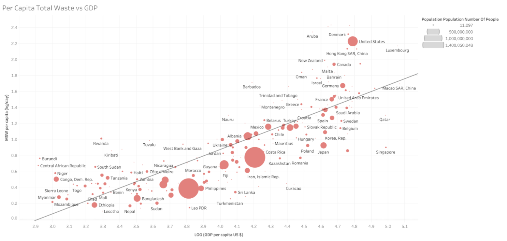
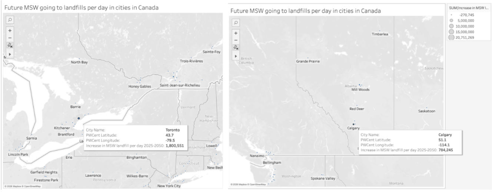
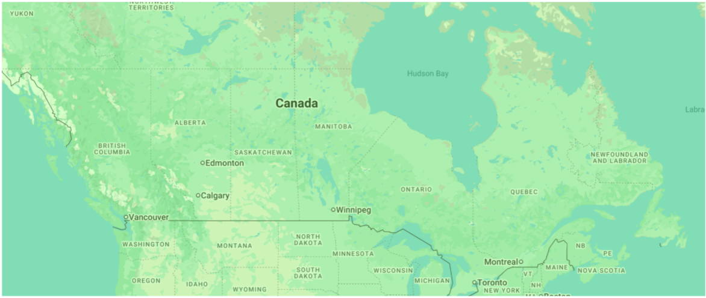

# Future Climate Impacts on Municipal Solid Waste Landfills in Canada 🗑️

A recent article written by [Xunchang Fei et al (2021)](https://www.nature.com/articles/s41558-021-01220-5) argues that climate change can amplify the environmental hazards from the land disposal of municipal solid waste (MSW). In Fig. 1a of this article, the authors showcase how locations of current high-density waste disposal will be affected by future climate change. One problem with this analysis is that the amounts of MSW will continue to grow due to income growth and urbanization in the future. Using the magnitude of current landfill in the analysis may lead to an underestimate of the impacts on landfills from future climate change.
As a solution, this project tries to fix this problem by finding out which cities’ landfills may be most affected by climate change utilizing multiple datasets on waste, economic growth, and urbanization

## Tools used: 
- Google Earth Engine
- Javascript

## Files
- `script.js` – main Earth Engine code
- `results/` – exported map visualization and data used to perform analysis 

## Datasets used: 
1) "Country level dataset" found in the ["What a Waste 2.0"](https://datatopics.worldbank.org/what-a-waste/) website by the World Bank to investigate the relationship between MSW per capita and GDP per capita through Tableau. This relationship will be used to estimate future MSW per capita in Canada
2) [SSP Database (Shared Socioeconomic Pathways) - Version 3.3](https://ssp.apps.ece.iiasa.ac.at/basic-drivers) by International Institute for Applied Systems Analysis to look up the future growth of GDP per capita in Canada
3) “WUP2025-F21-DEGURBA-Cities_Pop.xlsx” – population of Urban Agglomerations with 50,000 Inhabitants or More, 1975-2050 found in the website of [World Urbanization Prospects (WUP)](https://population.un.org/wup/) by the United Nations. Used to gather the population growth projections of big cities in Canada
4) [Interactive Atlas of future climate](https://interactive-atlas.ipcc.ch/regional-information) created by the Intergovernmental Panel on Climate Change 6th Assessment Report to evaluate future climate impacts 
   
## Results 

The “waste_treatment_landfill_unspecified_percent” of Canada for last year was 72.33%, therefore it was used as the proportion to estimate amounts of MSW going to landfills in each city. As a result, we can see above that Toronto, Calgary, Edmonton and Montreal are the cities that will experience the most increase in MSW landfill per day, with Toronto having the highest number (1,880,551 tons). 

When using the Interactive Atlas to find how many days there will be with temperatures higher than 35°C, it was found that Canada will not experience a lot of heavy heat days. Considering the country’s location, this is reasonable. However, according to the government, long-term forecasts indicate that the period from 2026 to 2030 will likely be the hottest five-year period on record for Canada. During this time, the country will experience many days with temperatures over 30°C. These temperatures are only more likely to increase with time.

## Live GEE Script
[Click here for the Google Earth Engine script](https://code.earthengine.google.com/2309c976d34a7239792a64eedf341566)
